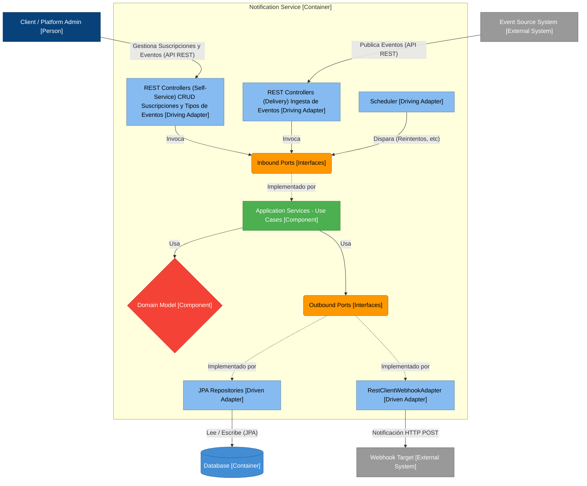

# Notification Service - Cobre Challenge 🚀

This service is the engine responsible for the resilient delivery of event notifications (webhooks) generated by the Cobre platform.

## 🧠 Architecture & Technical Decisions

For this challenge, a **Hexagonal Architecture (Ports & Adapters)** approach combined with **Vertical Slicing** was chosen. This ensures a complete decoupling between business rules and infrastructure details (database, HTTP clients).

### Key Patterns:
* **Transactional Outbox Pattern:** Ensures data consistency. Events are stored in the database within the same transaction as the state change, ensuring no notification is lost if the system fails before delivery.
* **Exponential Backoff Retry Strategy:** Implementation of automatic retries with increasing wait times to avoid overwhelming client servers during temporary failures.
* **Traceability & Logging:** Comprehensive event tracking across the delivery lifecycle, ensuring every notification state change is logged for auditability and future observability integration.

### 📋 Instructions to run the project
> pre requisites: Java 17 or higher, Docker & Docker Compose
1) Clone the repository, install all dependencies `mvn clean install`
2) Set up the database running `docker-compose up -d`
3) Run the application `mvn spring-boot:run`
4) Sample requests: `postman/Cobre.postman_collection.json`

## ⚖️ Technical Trade-offs & Assumptions

To fulfill the challenge requirements within the established timeframe while ensuring a reliable core engine, the following strategic decisions were made:

* **In-Memory Subscriptions:** For this version, webhook subscriptions are managed via an `InMemorySubscriptionAdapter`. This ensures the solution is "plug-and-play" for reviewers, avoiding the overhead of a dedicated Subscription CRUD, while maintaining the flexibility to swap it for a persistent DB adapter in the future thanks to the Hexagonal Ports.
* **JSON-Based Event Bootstrapping:** The system relies on a seed JSON file to load initial business events. This allows the Outbox Scheduler to demonstrate the delivery logic, retry policies, and state transitions immediately upon startup without requiring an external producer API or implement a ABM logic.
* **Test-Driven Reliability:** Resources were prioritized towards achieving **100% coverage in Application Services**. Ensuring that the business logic for notification delivery and search is bulletproof was considered more critical than implementing boilerplate CRUD operations for entities.

### Security Considerations
Following the proposition of the challenge, here are 3 main security concerns from the OWASP Top 10 2025:

**A01:2025 - Broken Access Control:**
Risk: Potential IDOR (Insecure Direct Object Reference) where a client could query or replay notifications from another merchant by changing the clientId in the request.

Mitigation: Enforce JWT-based authorization. The clientId used in the queries will be extracted from the authenticated security context, not the request body or URL parameters.

**A06:2025 - Insecure Design (Resource Exhaustion):**
Risk: Lack of rate-limiting on the Replay API or the search endpoint could lead to database denial of service (DoS).

Mitigation: Implementation of an API Gateway or local Rate Limiter and mandatory pagination for all query results to protect system resources.

**A07:2025 - Authentication Failures:**
Risk: Exposure of the delivery status and replay mechanism to unauthorized users on the public internet.

Mitigation: Mandatory HTTPS for all communication and the use of modern authentication protocols (OIDC/OAuth2) to ensure only verified clients can interact with the API.

### 🤖 AI Usage Documentation

In alignment with modern development practices, Generative AI (Local Agent & LLM Chat) was utilized throughout this project as a pair-programming assistant to enhance productivity and code quality. 

**Key Use Cases:**
1. **Scaffolding & Boilerplate:** Accelerated the initial setup of the Hexagonal Architecture directory structure and Spring Boot configuration.
2. **Testing Strategy:** Assisted in generating the foundational boilerplate for JUnit 5 and Mockito test suites, which were then manually refined to achieve >80% code coverage, particularly focusing on edge cases in the domain logic.
3. **Brainstorming & Debugging:** Used as a sounding board to discuss architectural trade-offs (e.g., Application Services vs. Domain Services) and to quickly identify concurrency issues (Race Conditions) between the data seeder and the scheduler.

*The core architectural decisions and final code reviews were strictly human-driven.*